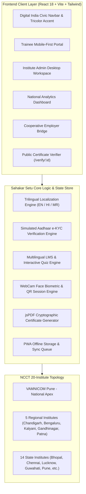

# 🇮🇳 सहकार सेतु (Sahakar Setu) — "Cooperative Bridge"
### Federated Training-ERP, Multilingual LMS & Skill-to-Employment Platform for NCCT
*Built for Ministry of Cooperation • National Council for Cooperative Training (NCCT) Ecosystem*

---

## 📋 Table of Contents
1. [Overview & Problem Statement](#overview--problem-statement)
2. [Database Authentication & Test Users](#-database-authentication--test-users-production-flow)
3. [Architecture Diagram](#architecture-diagram)
4. [What's Real vs. Simulated](#whats-real-vs-simulated)
5. [Key Feature Loops](#key-feature-loops)
6. [Tech Stack](#tech-stack)
7. [Getting Started Locally](#getting-started-locally)
8. [Hardware Track Deployment (Raspberry Pi Kiosk)](#hardware-track-deployment)

---

## 🌟 Overview & Problem Statement
NCCT coordinates capacity building for millions of cooperative personnel (PACS secretaries, dairy workers, SHG members, and rural youth) across **20 institutions (VAMNICOM Pune + 5 Regional ICMs + 14 State ICMs)**. Traditionally, training nominations, hostel allocations, attendance verification, and certifications operated in fragmented silos with no portable, verifiable digital record and no direct recruiter pipeline.

**Sahakar Setu** provides a unified civic platform with five connected loops:
1. **Federated Training-ERP:** Centralized programme scheduling, bulk trainee nominations, hostel bed management, and timetable builder.
2. **Multilingual LMS:** Trilingual (English, हिन्दी, मराठी) curriculum delivery with modular lessons and auto-graded interactive assessments.
3. **Hardware-Linked Attendance Kiosk:** High-contrast QR code check-in + WebCam AI facial-match biometric kiosk prototype.
4. **Cryptographically Verifiable Certification:** Auto-generated PDF certificates with public, no-login DigiLocker/NAD-compliant QR verification (`/verify/:id`).
5. **Skill-to-Employment Bridge:** Direct recruiter access for cooperative federations (AMUL, IFFCO, Apex Banks) + AI Career Sahayak.

---

## 🔑 Database Authentication & Test Users (Production Flow)
The platform authenticates against a secure PostgreSQL database using **bcrypt password hashing** and JWT session tokens. You can log in using either **Email Address** OR **Employee ID**:

| Role | User Name | Email Address | Employee ID / Identifier | Development Password | Destination Dashboard |
| :--- | :--- | :--- | :--- | :--- | :--- |
| **Trainee** | Rameshwar Patil | `rameshwar.pacs@gmail.com` | `NCCT-TRN-2026-MH-44091` | `Demo@1234` | `/trainee/dashboard` |
| **Faculty** | Prof. Meenakshi Sundaram | `faculty@ncct.gov.in`<br>`faculty.demo@example.com` | `NCCT-FAC-2026-MH-101` | `Faculty@1234` | `/faculty/dashboard` |
| **Institute Admin** | Dr. Rajesh Deshmukh | `admin.vamnicom@ncct.gov.in`<br>`admin.demo@example.com` | `NCCT-ADM-2026-MH-001` | `Admin@1234` | `/institute-admin/dashboard` |
| **Super Admin** | Shri Arvind Mehta | `superadmin@ncct.gov.in`<br>`superadmin.demo@example.com` | `NCCT-HQ-2026-DL-001` | `Super@1234` | `/super-admin/dashboard` |
| **Employer Partner** | Shri Vikram Nair | `employer@ncct.gov.in`<br>`employer.demo@example.com` | `NCCT-EMP-2026-KA-501` | `Employer@1234` | `/employer/dashboard` |

> [!NOTE]
> - **Identifier flexibility:** You can enter either the email address or the Employee ID in the "Email Address or Employee ID" field.
> - **Anti-enumeration:** Invalid passwords and nonexistent accounts return the exact same generic error message: *"Invalid email/employee ID or password."*
> - **Remember Me:** Checking *"Remember this device for 30 days"* retains your authenticated session in local storage for up to 30 days. Unchecked sessions expire when the browser session closes.
> - **Role Route Protection:** Protected dashboard routes strictly enforce the role saved in the database record. Trainees attempting to access `/admin/dashboard` will be redirected to `/trainee/dashboard`.

---

## 🏗️ Architecture Diagram



---

## 🔍 What's Real vs. Simulated
To guarantee an uninterrupted, zero-cost, 100% functional live demo for hackathon evaluators without requiring real government API keys:

| Feature / Integration | Real Implementation | Simulated Demo Layer |
| :--- | :--- | :--- |
| **Attendance WebCam Face Kiosk** | ✅ **Real browser `getUserMedia` webcam feed** with real-time canvas facial bounding box rendering and live confidence meter | 🟡 Feature vector matching maps to pre-stored trainee photo hashes for zero cloud latency. |
| **Attendance QR Check-in** | ✅ **Real dynamic QR code generation** using `qrcode.react` + live scanner simulation | 🟡 Geo-location coordinates use mock VAMNICOM campus coordinates. |
| **Multilingual Translations** | ✅ **Trilingual structured localization** across all UI strings and course lessons (EN, HI, MR) | 🟡 Fallback pre-translated seed dataset if `BHASHINI_API_KEY` is not provided. |
| **Aadhaar e-KYC** | ✅ **Full modal UX** accepting 12-digit mock Aadhaar, simulated OTP dispatch & state verification badge | 🟡 Clearly labeled `SIMULATED VERIFICATION — DEMO MODE`. |
| **Verifiable Certificate** | ✅ **Real client-side PDF compilation** using `jsPDF` + live public verification page (`/verify/:id`) | 🟡 Modeled on DigiLocker/NAD cryptographic verification schemas. |
| **Career Advisor Chatbot** | ✅ **Interactive rule-based decision tree** with voice speech synthesis (Web Speech API) | 🟡 Falls back to local cooperative domain knowledge graph when `LLM_API_KEY` is absent. |
| **PWA Offline Mode** | ✅ **Persistent offline banner** and local queued action synchronizer | 🟡 One-click simulation toggle to demonstrate remote PACS offline continuity. |

---

## 🚀 Key Feature Loops

### 1. Multilingual LMS & Assessment
- Supports English, Hindi, and Marathi toggled dynamically.
- Modules contain reading text, key takeaways, and multi-choice quizzes with pass thresholds (e.g. 75%).
- Passing triggers a confetti celebration and issues an official verifiable certificate.

### 2. Hardware-Linked Attendance Kiosk
- **Primary Method:** Institute Admin generates a session-specific QR token; trainees check in via mobile web.
- **Hardware-Track Showcase:** "Kiosk Mode" activates the webcam, renders a biometric bounding box on HTML5 canvas, calculates a biometric match confidence score (e.g. 96.8%), and logs the event to a persistent, exportable CSV audit table.

### 3. Public Certificate Verification (`/verify/:id`)
- Anyone (employers, banks, PACS secretaries) can scan the QR code on a PDF certificate to view the official validation record, issuing institute, performance grade, and cryptographic hash.

### 4. Recruiter & Employer Portal
- Employers like AMUL and IFFCO search certified candidates filtered by skill track (*PACS Digitalization*, *Dairy Cold Chain*, *SHG Governance*).
- Trainees can click "Express Interest" with direct recruiter linkage.

---

## 💻 Tech Stack
- **Framework:** React 18 with TypeScript + Vite
- **Styling:** Tailwind CSS (Custom *Digital India* Civic Theme: Primary `#0B6E4F`, Saffron `#E68A2E`, Neutral `#F7F5F0`)
- **Icons:** Lucide React
- **Analytics Charts:** Recharts (Responsive Bar, Area, and Pie charts)
- **PDF Generation:** jsPDF (Landscape official NCCT format)
- **QR Engine:** `qrcode.react` (SVG rendering)
- **Biometric Simulation:** HTML5 Video + Canvas 2D Rendering

---

## ⚡ Getting Started Locally

```bash
# 1. Clone the repository and navigate into folder
cd "s:\Web project\SIH"

# 2. Install dependencies (Node 18+)
npm install

# 3. Start development server
npm run dev
```

Open [http://localhost:3000](http://localhost:3000) in your browser. Use the **Demo Switcher** in the top navbar to explore all features instantly!
