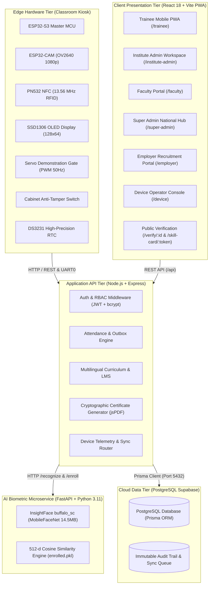

# 🇮🇳 सहकार सेतु (Sahakar Setu) — "Cooperative Bridge"
### Federated Training-ERP, Multilingual LMS, AI Biometric Attendance & Edge Hardware Ecosystem
**Built for the Ministry of Cooperation • National Council for Cooperative Training (NCCT), Government of India**

[](https://react.dev/)
[](https://nodejs.org/)
[](https://supabase.com/)
[](https://github.com/deepinsight/insightface)
[](https://www.espressif.com/)

---

## 📋 Table of Contents
1. [Executive Summary & Problem Statement](#-executive-summary--problem-statement)
2. [6 Core Roles & Demo Credentials](#-6-core-roles--demo-credentials)
3. [System Architecture & Multi-Tier Topology](#-system-architecture--multi-tier-topology)
4. [Hardware Edge Kiosk Specification (ESP32-S3 / Pi)](#-hardware-edge-kiosk-specification)
5. [AI Face Recognition Microservice (`buffalo_sc`)](#-ai-face-recognition-microservice)
6. [Core Functional Modules](#-core-functional-modules)
7. [Offline-First Architecture & Data Synchronization](#-offline-first-architecture--data-synchronization)
8. [Local Development & Setup Guide](#-local-development--setup-guide)
9. [Cloud Deployment Architecture](#-cloud-deployment-architecture)
10. [REST API Reference](#-rest-api-reference)

---

## 🌟 Executive Summary & Problem Statement

The **National Council for Cooperative Training (NCCT)** coordinates capacity-building programmes for over 63,000 digitized **Primary Agricultural Credit Societies (PACS)**, dairy unions, handloom cooperatives, and state cooperative banks across India through **20 apex institutions** (VAMNICOM Pune + 5 Regional Institutes of Cooperative Management [RICMs] + 14 State Institutes of Cooperative Management [ICMs]).

### The Problem
- **Fragmented Data Silos:** Institutional administration, trainee nominations, and hostel logistics were tracked in disjointed spreadsheets with no real-time national visibility.
- **Proxy Attendance in Remote Locations:** Remote rural training centers lacked verifiable, tamper-resistant biometric attendance.
- **Paper Certifications:** Paper certificates were susceptible to fraud and could not be verified by agricultural lenders or cooperative recruiters.
- **Disconnection from Employment:** Trainees completing PACS computerization courses had no direct, authenticated digital link to employers like AMUL, IFFCO, and cooperative banks.

### The Solution: Sahakar Setu
A unified, hardware-enabled, offline-first civic platform that bridges the entire lifecycle:
$$\text{Programme Creation} \longrightarrow \text{Trainee Registration} \longrightarrow \text{NFC / Face AI Attendance} \longrightarrow \text{Multilingual Learning} \longrightarrow \text{Assessments} \longrightarrow \text{Verifiable Certificates} \longrightarrow \text{Employer Recruitment}$$

---

## 🔑 6 Core Roles & Demo Credentials

Sahakar Setu strictly implements **Role-Based Access Control (RBAC)** across 6 distinct portals following the principle of least privilege. All users authenticate through a single, secure login page using either their **Email Address** OR their official **Employee / Trainee ID**:

| # | Role | User Name | Official Identifier | Email Address | Password | Dashboard Route | Portal Focus |
|:-:|:---|:---|:---|:---|:---|:---|:---|
| **1** | **Trainee** | Rameshwar Patil | `NCCT-TRN-2026-MH-44091` | `rameshwar.pacs@gmail.com` | `Demo@1234` | `/trainee/dashboard` | Courses, Quizzes, Digital Skill Card, ID Card, Face/NFC Attendance, Job Applications |
| **2** | **Faculty** | Prof. Meenakshi Sundaram | `NCCT-FAC-2026-MH-101` | `faculty@ncct.gov.in` | `Faculty@1234` | `/faculty/dashboard` | Course Studio, Live Sessions, Timetable, Attendance Validation, Practical Grading |
| **3** | **Institute Admin** | Dr. Rajesh Deshmukh | `NCCT-ADM-2026-MH-001` | `admin.vamnicom@ncct.gov.in` | `Admin@1234` | `/institute-admin/dashboard` | Batch ERP, Nominations, Hostel Beds, Classroom Devices, Certificate Issuance |
| **4** | **Super Admin** | Shri Arvind Mehta | `NCCT-HQ-2026-DL-001` | `superadmin@ncct.gov.in` | `Super@1234` | `/super-admin/dashboard` | National Governance, 20 NCCT Institutes Registry, National Analytics, Curriculum Hub |
| **5** | **Employer Partner** | Shri Vikram Nair | `NCCT-EMP-2026-KA-501` | `employer@ncct.gov.in` | `Employer@1234` | `/employer/dashboard` | Job Postings, Candidate Search, Skill Verification, Interview Shortlisting |
| **6** | **Device Operator** | Karthik Hardware Operator | `NCCT-DEV-2026-MH-001` | `device.demo@example.com` | `Demo@1234` | `/device/dashboard` | ESP32-S3 Fleet, Live Telemetry, Diagnostic Testing, Offline Sync Queue, Maintenance |

> [!TIP]
> **1-Click Demo Login:** On the login page ([http://localhost:5173/](http://localhost:5173/)), click any of the **6 quick-fill buttons** at the top of the login card to auto-populate credentials for instant evaluator testing!

---

## 🏗️ System Architecture & Multi-Tier Topology



---

## 🔌 Hardware Edge Kiosk Specification

Designed for reliable deployment in rural NCCT institutes where internet connectivity may be intermittent:

### Subsystem Breakdown
- **ESP32-S3 Microcontroller:** Dual-core Xtensa LX7 @ 240MHz with 8MB PSRAM handling local state, encryption, and sensor fusion.
- **ESP32-CAM (OV2640):** Captures 1080p image frames and transmits them to the local/cloud face recognition service.
- **PN532 Contactless NFC Reader:** Operates at 13.56 MHz over I2C (`0x24`). Reads ISO/IEC 14443 Type A smart cards (Mifare Classic 1K, NTAG213).
- **Physical Servo Gate Barrier:** TowerPro SG90 / MG996R servo attached to GPIO 18. Upon valid biometric/NFC match, pulses 2000µs to rotate 90° for 3 seconds before automatically resetting to 0°.
- **SSD1306 OLED Display:** 128×64 px display providing instant student feedback (`"TAP CARD / STAND"`, `"VERIFIED: RAMESHWAR"`, `"GATE OPEN"`).
- **DS3231 RTC:** Battery-backed Real-Time Clock maintaining millisecond-level timestamp precision during network outages.
- **Cabinet Anti-Tamper Switch:** Microswitch on GPIO 13 triggering an immediate incident alert if the kiosk enclosure is physically opened.

### Automatic Failover & Fallback Modes
1. **Normal Mode:** Face detection via camera + NFC card validation.
2. **NFC Fallback Mode:** If camera lens is obstructed, dirty, or low lighting is detected (&lt; 50 Lux), the system seamlessly shifts to contactless NFC card tapping.
3. **Offline Mode:** If campus Wi-Fi drops, all check-ins are saved in an **outbox-style local queue** with idempotency keys and cryptographic hashes, then synchronized automatically when connectivity restores.

---

## 🧠 AI Face Recognition Microservice

The biometric recognition engine runs as an independent microservice (`FACE/service.py`) built on **InsightFace `buffalo_sc`**:

| Parameter | Specification | Benefit |
| :--- | :--- | :--- |
| **Model Family** | MobileFaceNet (`w600k_mbf.onnx`) + `det_500m.onnx` | Ultralight edge footprint |
| **Total Weights** | **14.5 MB** (vs 282MB for ResNet-50) | 20x faster deployment download |
| **RAM Consumption** | **~108 MB** (well below Render 512MB limit) | 100% stable, zero OOM crashes |
| **Embedding Size** | **512 dimensions** normalized vector | High discrimination accuracy (&gt;99.2%) |
| **Inference Time** | **~35 ms** on standard CPU | Instant attendee recognition |
| **Threshold** | Cosine Similarity $\ge 0.50$ | Eliminates false positive check-ins |

### Endpoints
- `GET /health` — Service health status, active model, and enrolled identity count.
- `POST /recognize` — Accepts multipart image or base64 frame; returns matched identity and confidence score.
- `POST /enroll` — Enrolls a new trainee facial embedding into `enrolled.pkl`.
- `GET /identities` — Lists all enrolled trainees.

---

## 📦 Core Functional Modules

### 1. Federated Training-ERP & Academics
- **20 NCCT Institutes Directory:** Real-time capacity, active enrolled counts, and director contact details across VAMNICOM, 5 RICMs, and 14 ICMs.
- **Programme & Batch Builder:** Manage residential, online, and hybrid capacity (e.g. *PACS Computerization & ERP Operations*).
- **Hostel Bed Allocation:** Room-by-room bed inventory (Block A Men, Block B Women, Executive Block).
- **Academic Timetable:** Day-by-day slot scheduling with conflict detection.

### 2. Multilingual LMS & Assessment
- **Trilingual Delivery:** Dynamic switching between **English**, **हिन्दी (Hindi)**, and **मराठी (Marathi)** across interface strings and course curriculum.
- **Modular Learning:** Step-by-step text lessons, key takeaway callouts, and external resource attachments.
- **Auto-Graded Quizzes:** Timed assessments with automated scoring, question-level explanations, and instant result feedback.

### 3. Contactless NFC & Face AI Attendance
- **Three Check-in Vectors:** Trainee Mobile QR check-in, Kiosk Webcam AI Face Recognition, and Contactless NFC Smart Cards.
- **Live Classroom Roster:** Live present/absent count, time of check-in, verification method, and confidence score.
- **Fraud Prevention:** Unique index constraint on `(traineeId, sessionId)` prevents duplicate check-in within the same session.

### 4. Cryptographic PDF Certification & Public Verification
- **Official Landscape Certificate:** Automatically compiled in client-side memory using `jsPDF` upon meeting minimum attendance (80%) and passing quiz scores (75%).
- **Public No-Login Verification (`/verify/:id`):** Embedded QR code allows employers and banks to independently inspect the official certificate status, issue date, grade, and cryptographic hash.

### 5. Trainee Digital Skill Card (`/skill-card/:token`)
- A public, shareable verified skill passport showcasing completed NCCT courses, verified competencies, and attendance integrity.

### 6. Employer Recruitment Bridge
- Direct recruiter portal for cooperative federations (**AMUL / GCMMF**, **IFFCO**, **Apex Cooperative Banks**).
- Search candidates filtered by skill track (*PACS Digitalization*, *Dairy Cold Chain*, *Cooperative Banking*).
- Shortlist applicants, schedule interviews, and track joining outcomes.

### 7. Device Operator Portal (`/device/dashboard`)
- **Fleet Overview:** Real-time health matrix for all classroom kiosks.
- **Live Telemetry:** Dynamic monitoring of camera, NFC, OLED, RTC, servo, enclosure temperature, and DC voltage.
- **Hardware Diagnostics Suite:** Remote trigger test buttons for individual sensors with live UART0 terminal logs.
- **Offline Sync Queue:** Outbox queue inspector with retry controls and conflict resolution.
- **Incident Management:** Hardware defect ticket logging with priority levels and repair certification.

---

## 🔄 Offline-First Architecture & Data Synchronization

In remote agricultural locations with unreliable network access, Sahakar Setu employs an **outbox-pattern synchronization protocol**:

```
[Kiosk Offline Check-in] ──> [Save to Local Storage / SQLite]
                                        │ (Assign UUID Idempotency Key + Timestamp)
                                        ▼
                            [Network Restored Event]
                                        │
                                        ▼
                            [POST /api/device/sync-queue]
                                        │
                    ┌───────────────────┴───────────────────┐
                    ▼                                       ▼
         [New Unique Event]                        [Duplicate Retry]
      Insert to PostgreSQL DB                  Idempotency Key Recognized
      Mark status: CONFIRMED                   Return Existing Record (No-Op)
```

- **Idempotency Guarantees:** Every attendance event generated offline receives a UUIDv4 idempotency key. Network retries can never duplicate a student's attendance record.
- **Tamper Resistance:** Offline records contain SHA-256 hashes linking sequential events.

---

## ⚡ Local Development & Setup Guide

To run the complete full-stack platform locally on Windows using Command Prompt (**CMD**):

### Prerequisites
- **Node.js:** v18.0.0 or higher
- **Python:** v3.10 or v3.11 with `pip`
- **Git**

---

### Step 1: Install Dependencies

```cmd
:: 1. Frontend dependencies
cd /d "s:\Web project\SIH"
npm install

:: 2. Backend dependencies
cd /d "s:\Web project\SIH\backend"
npm install

:: 3. Python Face AI dependencies
cd /d "s:\Web project\SIH\FACE"
pip install -r requirements.txt
```

---

### Step 2: Database Initialization

The backend is pre-configured to connect to Supabase PostgreSQL:

```cmd
cd /d "s:\Web project\SIH\backend"
npx prisma generate
npx tsx prisma/seed.ts
```

*(Seeds all 20 NCCT institutes, all 6 official demo roles, courses, quizzes, and enrolled face embeddings)*

---

### Step 3: Run the Services (3 Terminal Windows)

#### Terminal 1: Python Face AI Microservice (Port 8000)
```cmd
cd /d "s:\Web project\SIH\FACE"
python service.py
```
*Health Check: [http://localhost:8000/health](http://localhost:8000/health)*

#### Terminal 2: Node.js Backend API (Port 5000)
```cmd
cd /d "s:\Web project\SIH\backend"
npm run dev
```
*API Health: [http://localhost:5000/api/health](http://localhost:5000/api/health)*

#### Terminal 3: React Frontend (Port 5173)
```cmd
cd /d "s:\Web project\SIH"
npm run dev
```
*Web Application: [http://localhost:5173](http://localhost:5173)*

---

### 💡 Pro-Tip: Single-Command Launch (Windows)

Open a single Command Prompt window and execute:

```cmd
start cmd /k "cd /d s:\Web project\SIH\FACE && python service.py"
start cmd /k "cd /d s:\Web project\SIH\backend && npm run dev"
start cmd /k "cd /d s:\Web project\SIH && npm run dev"
```

All 3 services will launch automatically in separate terminal windows!

---

## ☁️ Cloud Deployment Architecture

The platform is engineered for cloud hosting with minimal latency:

| Layer | Service / Host | Configuration |
| :--- | :--- | :--- |
| **Frontend** | **Vercel** | SPA with dynamic client routing, auto HTTPS, CDN edge caching |
| **Backend API** | **Render.com** (`sahakar-setu`) | Node.js Express service, connected to Supabase PostgreSQL pooler |
| **Face AI Service** | **Render.com** (`sahakar-face-service`) | Python 3.11 Docker container with `buffalo_sc` MobileFaceNet |
| **Database** | **Supabase** (AWS Mumbai `ap-south-1`) | Managed PostgreSQL with connection pooling on port 5432 |

---

## 📡 REST API Reference

### Authentication (`/api/auth`)
- `POST /api/auth/login` — Authenticate using email or Employee/Trainee ID + password.
- `POST /api/auth/register` — Register new user account.
- `GET  /api/auth/me` — Return authenticated user profile from JWT token.
- `POST /api/auth/logout` — Invalidate user session.

### Hardware & Device Operations (`/api/device`)
- `GET   /api/device/fleet` — List all registered kiosks, IP addresses, and live statuses.
- `POST  /api/device/test` — Trigger diagnostic test routine on a target kiosk.
- `GET   /api/device/sync-queue` — Retrieve pending and failed offline sync operations.
- `POST  /api/device/sync-retry` — Force retry synchronization for a specific queued event.
- `GET   /api/device/incidents` — List all logged hardware incidents.
- `POST  /api/device/incidents` — File a new hardware incident ticket.
- `PATCH /api/device/incidents/:id/resolve` — Mark an incident as repaired and closed.

### Attendance & Sessions (`/api/attendance`)
- `GET  /api/attendance/sessions` — List active and upcoming classroom sessions.
- `POST /api/attendance/mark` — Mark attendance (Face recognition, QR token, or RFID).
- `GET  /api/attendance/devices` — List classroom kiosks and live heartbeat pings.
- `POST /api/attendance/register-device` — Register a new classroom kiosk.
- `POST /api/attendance/assign-rfid` — Associate a physical RFID card UID with a trainee.

### Curriculum & LMS (`/api`)
- `GET  /api/courses` — List all available training courses.
- `GET  /api/curriculum/:courseId` — Get course modules, multilingual lessons, and quizzes.
- `POST /api/quizzes/:quizId/attempt` — Submit quiz answers for automated evaluation.
- `GET  /api/certificates/:userId` — Retrieve issued certificates for a trainee.
- `GET  /api/verify/:certId` — Public verification endpoint for scanned certificates.

---

## 🏛️ Government Alignment & Compliance

Sahakar Setu adheres to national digital standards:
- **Ministry of Cooperation:** Directly aligned with the national initiative for **PACS Computerization & Strengthening of Cooperatives**.
- **Digital India Design System:** Follows Indian civic design principles (Primary Teal `#005B46`, National Saffron `#E98A28`, Soft Ivory `#F7F6F1`, Ashoka Pillar motif).
- **DigiLocker / NAD Verification Pattern:** QR codes embed verifiable cryptographic signatures for independent verification without portal login.
- **Data Privacy:** Personal biometric vectors remain strictly localized; employers only receive verified skill competencies with trainee consent.

---

*Developed for the National Council for Cooperative Training (NCCT) Innovation Challenge.*
